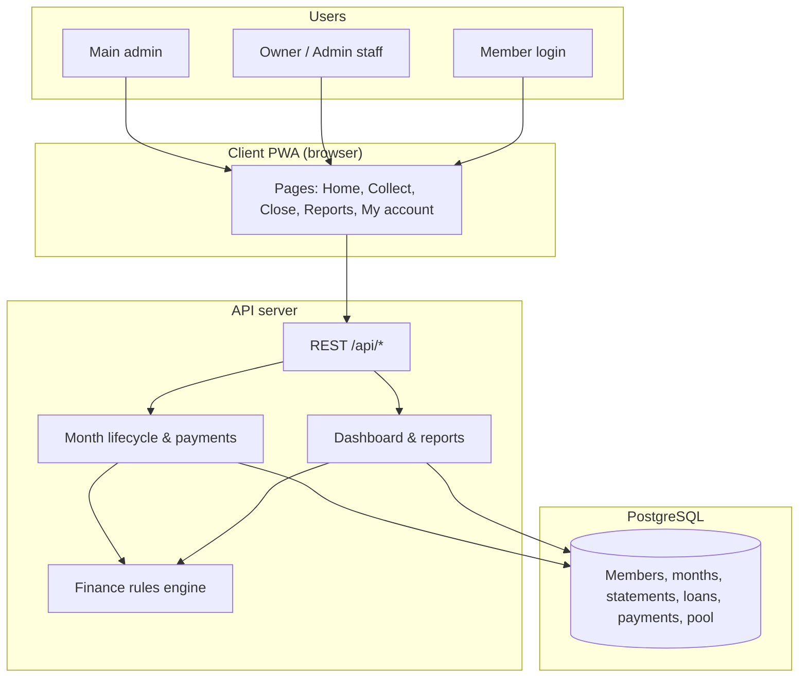
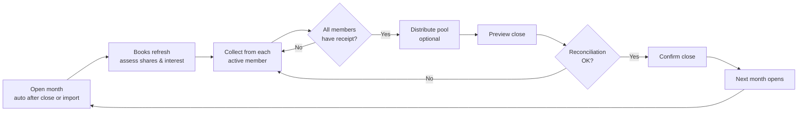
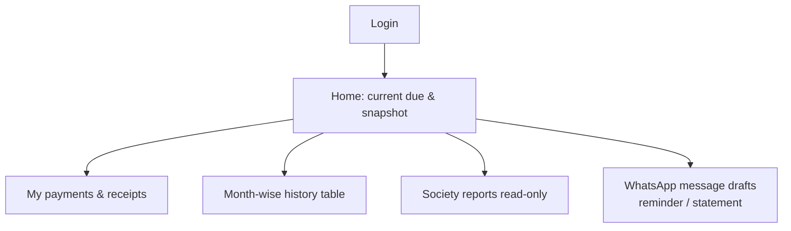

# Society Finance — High-Level Design & Application Flow

**Audience:** Society office bearers, auditors, and IT stakeholders  
**Product:** Mobile-first web app (PWA) for member-funded savings and lending societies  
**Version note:** Reflects the codebase as of October 2026 demo data (श्री क्रांतीसूर्य भगतसिंग क्रिड़ेट सोसायटी register)

**Visual guide (diagrams + screenshots):** open [`client-flow-guide/index.html`](client-flow-guide/index.html) in a browser — see [`client-flow-guide/README.md`](client-flow-guide/README.md).

---

## 1. What the system does (one paragraph)

Members contribute **shares** into a common pool. The society **lends** from that pool to members. Each month, members pay an **installment**: share, loan **principal**, **interest** on outstanding loans, and any **penalties**. Only **collected** interest and penalties enter the **distribution pool**, which is split **equally** among active members—either as **cash** or as **credit to shares**. The app keeps one **open accounting month** at a time; closing a month freezes books and opens the next month automatically.

---

## 2. Architecture (logical)

| Layer | Technology |
|--------|------------|
| Client | React, Vite, Tailwind — installable PWA |
| Server | Node.js, Express, TypeScript |
| Database | PostgreSQL via Prisma |
| Auth | Username/mobile + password; secure httpOnly session cookie |
| Exports | PDF and Excel for reports and receipts |

---

## 3. Roles and access

| Role | Who | Can do |
|------|-----|--------|
| **Main admin** | Platform operator | Create societies, create society owner/admin logins |
| **Owner** | Society lead | Everything staff can do + society name/logo, backup, reverse interest distribution |
| **Admin** | Office staff | Members, collect, loans, penalties, close month, distribute pool, most settings |
| **Member** | Linked to one member record | View own dues, payments, loan, month-wise history, society reports (read-only) |

Members **cannot** see other members’ private data or change books.

---

## 4. Core concepts (business language)

| Term | Meaning in the app |
|------|---------------------|
| **Accounting month** | One calendar month (YYYY-MM). Exactly **one** month is **OPEN**; older months are **CLOSED** and unchanged. |
| **Member month statement** | That member’s dues and balances for one month (share, loan, interest, penalty, installment). |
| **Share** | Member capital in the pool; monthly share assessment + arrears + pool credits to shares. |
| **Loan** | Disbursement increases member debt; collections reduce **principal** per schedule. |
| **Interest** | Accrued on outstanding loan each month; only **collected** interest feeds the pool. |
| **Penalty** | Manual or deferred charges; collected penalties also feed the pool. |
| **Distribution** | Split pool among active members (cash or shares); recorded with audit trail. |
| **Receipt / payment** | Official collection for a member in the **open** month; drives allocation order (share → previous interest → current interest → principal → penalty). |

---

## 5. End-to-end monthly cycle (main staff flow)

This is the rhythm the office follows every month.

### Step-by-step (staff)

1. **See open month** — Home dashboard shows current period, totals, and who still owes.
2. **Ensure books are current** — Opening member lists or dashboard refreshes statements (share assessment, loan interest accrual).
3. **Collect payment** (`/app/pay`) — Choose member, enter amount; system **previews** allocation; save receipt; PDF receipt available.
   - Even **₹0** receipt may be needed if a member has nothing due but must be “touched” for the month.
4. **Add penalties / extra principal** — As needed before or during collection.
5. **Disburse new loans** — Only in open month; increases society loan outstanding.
6. **Distribute interest/penalty pool** (`/app/interest`) — Preview equal split; pay **cash** or **credit shares**; requires collection gate (every active member has a receipt for the open month).
7. **Close month** (`/app/close`) — Preview shows collections, carry-forward dues, society balance checks; **confirm** closes month and **opens next month** with new statements.
8. **Reports** — Month sheet (dues), month collected, monthly closing, loan register, interest/penalty reports; PDF/Excel export.

---

## 6. One-time society setup flows

### A. New society (main admin)

1. Main admin signs in → **Platform**.
2. Create society + first **Owner** login.
3. Owner signs in → **Settings**, **Members**, or **Import**.

### B. Bootstrap from Excel register (empty society only)

1. **Import** — Allowed only when **no members** exist yet.
2. Upload register sheet (Marathi/English column headers supported).
3. Choose **current** or **previous** calendar month for the sheet.
4. Preview validations → **Confirm** creates members, loans, share balances, and opens that month.
5. Collect for that month → close → repeat until caught up to live month.

### C. Manual members (no import)

1. Add each member with login (optional).
2. Open month tracks **calendar month** when society is empty/manual.

---

## 7. Member experience

- **Month-wise history** mirrors office logic: shares, **distributed int+pen to shares**, loan, installment components, received, still due.
- **My month report** — PDF/Excel export of personal timeline.

---

## 8. Deactivate / reactivate member

| Check | Behavior |
|--------|----------|
| Outstanding loan | **Cannot** deactivate until loan cleared |
| Receipt already in **open** month | **Cannot** deactivate until month closed or receipt removed |
| Pool money undistributed | Warning before deactivate (distribution may need to happen first) |
| After deactivate | Login disabled; balances zeroed in books; excluded from active totals |
| Reactivate | Restores active status; open-month statement can be rebuilt |

---

## 9. Dashboard metrics (what leadership sees)

| Metric | Plain meaning |
|--------|----------------|
| **Member capital** | Active members’ share capital from **open month sheet** closing shares + share collected this month (not inactive ghosts). |
| **Loans outstanding** | Active members’ loan principal still owed. |
| **Interest / penalty earned (pool)** | Collected amounts available to distribute. |
| **Society cash (indicative)** | Member capital − loans outstanding + interest pool + penalty pool (formula on home). |
| **Month collected** | Breakdown of receipts in the open month (share, interest, principal, penalty). |

---

## 10. Reports catalog (staff & members)

| Report | Purpose |
|--------|---------|
| Month sheet | Who owes what this month (dues) |
| Month collected | What was actually received |
| Monthly collection / closing | Month-end summary and penalty columns |
| Loans | Register and history |
| Interest accrued / collected / distribution | Pool audit trail |
| Penalties | Assessed vs collected |
| Member timeline | Personal month-wise history (incl. pool-to-shares column) |

---

## 11. Data integrity rules (why the app says “no”)

- **Closed months are read-only** — receipts cannot be added/edited except via controlled **reopen last month** (strict checks).
- **Month close blocked** if society balance reconciliation fails (prevents silent money creation).
- **Import once** — prevents duplicate register posting.
- **Distribution blocked** until every **active** member has a receipt for the open month.
- **Payment delete** blocked if interest already distributed to shares.

---

## 12. Deployment & operations (summary)

- Run API + client (see root `README.md`); production can serve built client from API.
- PostgreSQL required; `JWT_SECRET` must be set in production.
- **Backup** (Owner): JSON export of core tables.
- **Audit log** and in-app **notifications** for key actions.

---

## 13. Known limitations (set expectations with client)

- Interest distribution method is **equal split** among active members (config strings exist; implementation matches equal split).
- Some advanced report types exist in API but are not linked in the reports menu yet.
- Demo README passwords may differ from seeded usernames; change passwords after go-live.
- Heavy month-close and heal logic runs on server; office should use **explicit refresh** after big changes (collect, close, distribute)—not background auto-sync on every tab focus.

---

## 14. Quick reference — screens → URL

| Screen | Staff path | Member path |
|--------|------------|-------------|
| Home | `/app` | `/me` |
| Collect | `/app/pay` | — |
| Payments list | `/app/payments` | `/me/payments` |
| Members | `/app/members` | — |
| Loans | `/app/loans` | `/me/loan` |
| Interest / distribute | `/app/interest` | `/me/interest` |
| Close month | `/app/close` | — |
| Reports | `/app/reports` | `/me/reports` |
| Import | `/app/import` | — |
| Settings | `/app/settings` | — |

---

*For technical maintainers: domain logic lives in `server/src/services/books.ts`, `server/src/services/read.ts`, and `server/src/engine/finance.ts`; UI routes in `client/src/App.tsx`.*
